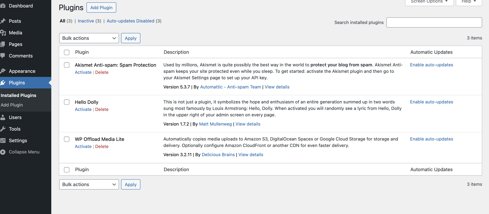
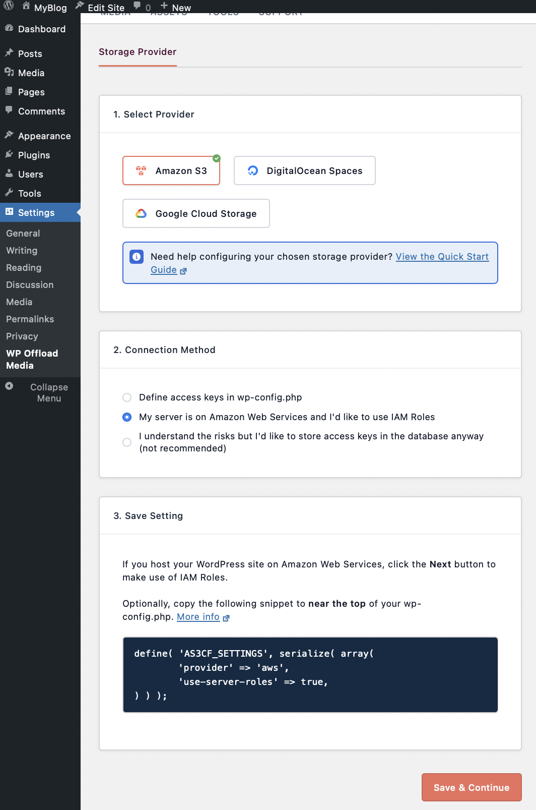
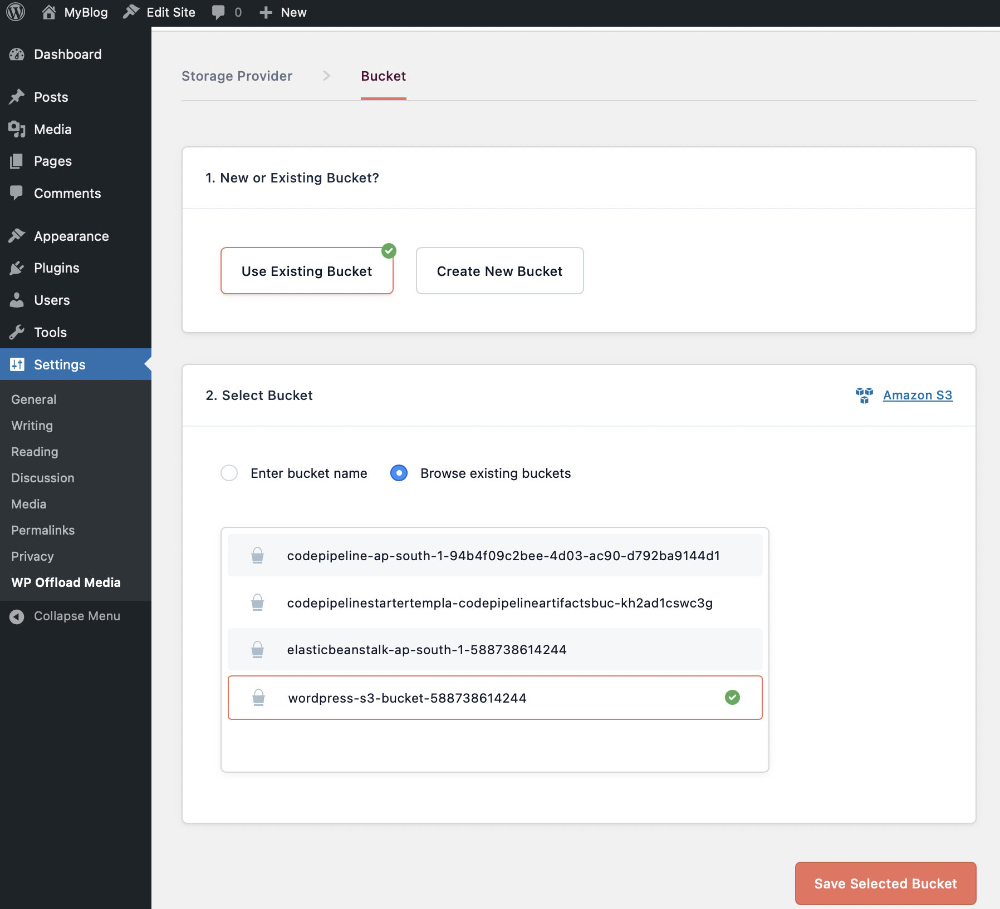
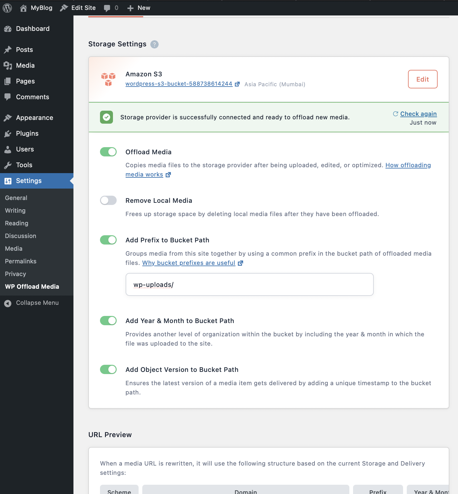

🚀 Phase 2: Serve Static Content from S3 via CloudFront

🧩 Objective

    Move all static files (/static/) to S3 bucket
    Replace static URLs in the Wordpress to load from CloudFront CDN
    Configure CloudFront for performance, caching, and security

✅ STEP-BY-STEP INSTRUCTIONS

    🪣 1. Create an S3 Bucket for Static Content

        Go to S3 > Create Bucket:
            
            Name: wordpress-s3-bucket-[account-id]
            Region: Same as your app
            Uncheck Block all public access (temporarily)
            Enable Bucket versioning (recommended)
            Upload your below files:
            Upload index.html, style.css and upload.js to the bucket.
            Create a folder "wp-uploads"

    🔐 2. Set Bucket Policy to Allow Public Read (or Use OAI)

        For testing, you can set this public-read policy:

        {
        "Version": "2012-10-17",
        "Statement": [
        {
            "Sid": "AllowPublicRead1",
            "Effect": "Allow",
            "Principal": "*",
            "Action": "s3:GetObject",
            "Resource": "arn:aws:s3:::wordpress-s3-bucket-<your-account-no>/*"
        },
        {
            "Sid": "AllowPublicRead2",
            "Effect": "Allow",
            "Principal": "*",
            "Action": "s3:GetObject",
            "Resource": "arn:aws:s3:::wordpress-s3-bucket-<your-account-no>/wp-uploads/*"
        },
        {
            "Sid": "AllowPublicUpload",
            "Effect": "Allow",
            "Principal": "*",
            "Action": "s3:PutObject",
            "Resource": "arn:aws:s3:::wordpress-s3-bucket-<your-account-no>/wp-uploads/*"
        }
        ]
        }

        🔒 For production, you'll use CloudFront Origin Access Control (OAC) instead of making the bucket public.
    
    🧭 3. There is a file in Phase-2 folder with name "script.sh". Please create a file in the EC2 instance and execute it using below instructions:

        Login into EC2 instance. 
        
        Run below commands:

            vi script.sh

        #Copy the content of "script.sh" in the Phase-2 folder and paste it in the EC2 script.sh promt. After pasting the context, press escape button and type " :wq! ". Continue with below commands

            chmod +x script.sh

            bash script.sh 
        
        if in case of any errors, please try to correct and continue.
    
    🧭 4. Create a Role to connect from EC2 to S3:

        Go to IAM -> Roles -> Create Role:

        Select AWS Service -> Choose "EC2" from the list > Click Next.

        Select S3FullAccess policy and Click Next. 

        Give Role name "Wordpress_S3_Role" -> Create Role. 

    🧭 5. Attach role to EC2 instance:

        Go to EC2 -> Instances -> Select the wordpress instance

        Click on Actions -> Security -> Modify IAM role

        Choose IAM Role that you have created in last step -> Update IAM Role.

    🧭 6. This is enable the plugin to configure the sync from S3 to EC2:

        Access your load-balancer wordpress DNS. append "wp-admin/plugins.php" at the end. 
        The URL should be like this -> http://<load-balancer-dns>/wp-admin/plugins.php

        Now, you will see a screen looks like below:

        

        Click on "Activate" of the plugin "Wp Offload Media Lite".
        Once Activated, Click on Settings and Select the options according to the below image -> "Save and Continue"

        

        
        Select the existing bucket -> Browse the buckets and select the S3 bucket -> "Save and Continue" -> "Keep the Bucket Security As is". Make sure the the prefix is wp-uploads/

        

        

    🧭 4. Create a CloudFront Distribution

        Go to CloudFront > Create Distribution:
            
            Origin Settings
            Origin domain: Select your S3 bucket
            Default root object: index.html
            Origin access: Use Origin Access Control (OAC)
            Create new OAC
            Default cache behavior
            Viewer protocol policy: Redirect HTTP to HTTPS
            Allowed HTTP methods: GET, HEAD
            Cached HTTP methods: GET, HEAD
            WAF: Do not enable 
            Settings:
            Price class: Use default (or regional if cost-sensitive)

        Create the Distribution

        It provides the popup to upload the S3 bucket policy. Copy the policy -> Click on "Go to S3 bucket permissions to update policy" -> Go to Permissions -> Edit the Policy -> Carefully amend the existing policy. It should looks like below at the end:

        {
        "Version": "2012-10-17",
        "Statement": [
        {
            "Sid": "AllowPublicRead1",
            "Effect": "Allow",
            "Principal": "*",
            "Action": "s3:GetObject",
            "Resource": "arn:aws:s3:::wordpress-s3-bucket-<account-no>/*"
        },
        {
            "Sid": "AllowPublicRead2",
            "Effect": "Allow",
            "Principal": "*",
            "Action": "s3:GetObject",
            "Resource": "arn:aws:s3:::wordpress-s3-bucket-<account-no>/wp-uploads/*"
        },
        {
            "Sid": "AllowPublicUpload",
            "Effect": "Allow",
            "Principal": "*",
            "Action": "s3:PutObject",
            "Resource": "arn:aws:s3:::wordpress-s3-bucket-<account-no>/wp-uploads/*"
        },
        {
            "Sid": "AllowCloudFrontServicePrincipal",
            "Effect": "Allow",
            "Principal": {
                "Service": "cloudfront.amazonaws.com"
            },
            "Action": "s3:GetObject",
            "Resource": "arn:aws:s3:::wordpress-s3-bucket-<account-no>/*",
            "Condition": {
                "StringEquals": {
                    "AWS:SourceArn": "arn:aws:cloudfront::<account-no>:distribution/<cloudfront-disturbution-id>"
                }
            }
        }
        ]
        }

        ⚠️ It can take 5–15 minutes to deploy.

    🔁 5. Test
        
        Visit the S3 static content through the CloudFront URL.
        Check browser DevTools → Static assets should load from CloudFront

📦 Summary of Phase 2

    S3 Bucket	Hosts static files
    CloudFront CDN	Delivers assets globally
    Flask Templates	Updated to use CDN
    Security	Optionally use OAC instead of public access
